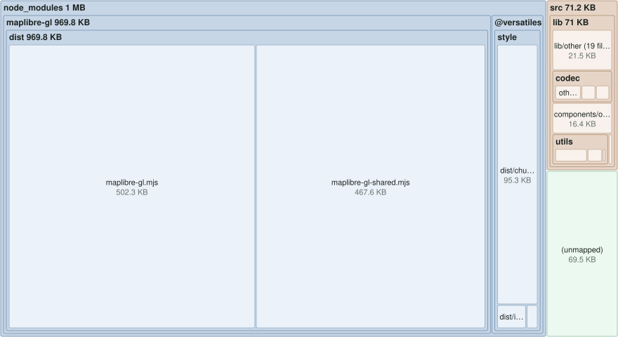

# VersaTiles Map Editor

A standalone, embeddable map editor for [VersaTiles](https://versatiles.org). Draw and style markers, lines, circles and polygons on a vector map and share the result via a self-contained URL hash.

This is a [SvelteKit](https://svelte.dev/docs/kit) application built with [MapLibre GL](https://maplibre.org/) and [`@versatiles/style`](https://github.com/versatiles-org/versatiles-style). It was extracted from [`node-versatiles-svelte`](https://github.com/versatiles-org/node-versatiles-svelte) to be developed on its own.

## Development

```bash
npm install
npm run dev      # start the dev server
npm run build    # build the static site (adapter-static)
npm run preview  # preview the production build
```

### Quality checks

```bash
npm run lint            # ESLint
npm run check-types     # svelte-check (TypeScript + Svelte)
npm run format:check    # Prettier
npm run test-unit       # Vitest unit tests
npm run test-playwright # Playwright visual/e2e tests
```

### Documentation

```bash
npm run doc             # regenerate the sections below
npm run doc-bundle      # bundle treemap only
npm run doc-graph       # dependency graph only
```

### Bundle Composition

<!--- This chapter is generated automatically --->

[](docs/bundle-treemap.svg?raw=true)

Sized by the bundle's own source map: **756.4 KB** raw, **203.7 KB** gzipped, across 51 modules.

### Dependency Graph

<!--- This chapter is generated automatically --->

[](docs/dependency-graph.svg?raw=true)

## Embedding

The editor reads its state from the URL hash, so it can be embedded in an `<iframe>`:

```html
<iframe src="https://your-host/#<state-hash>" style="width: 600px; height: 600px;"></iframe>
```

When embedded (i.e. not the top-level window) the editing sidebar is hidden and the map renders in read-only mode. The state can alternatively be provided via the iframe's `data` attribute.

## Configuration

An organisation running the editor can offer its own color schemes and fonts, e.g. its corporate identity. Put them into `map-editor.config.json` next to the editor's `index.html` (in this repository: `static/map-editor.config.json`, which is empty). No rebuild is needed. Every field is optional:

```json
{
	"colorSchemes": [{ "id": "corporate", "name": "Corporate", "colors": ["#003366", "#e30613", "#f5a800"] }],
	"replaceDefaultSchemes": false,
	"fonts": ["open_sans_regular", "lato_bold"],
	"replaceDefaultFonts": false
}
```

- `colorSchemes` are offered in the color picker before the predefined schemes. With `replaceDefaultSchemes`, only they are offered, and the first one is the default.
- `fonts` are glyph names of the tile server (see `https://tiles.versatiles.org/assets/glyphs/`). They are offered for the labels of the map and its markers. Fonts that are not available as map glyphs are skipped with a warning in the browser console. With `replaceDefaultFonts`, only they are offered.

A missing or invalid file leaves the defaults. The legend uses a generic font (sans-serif, serif or monospace) instead, since the map's glyph fonts are usually not available as web fonts.

## License

MIT — see [LICENSE](LICENSE).
