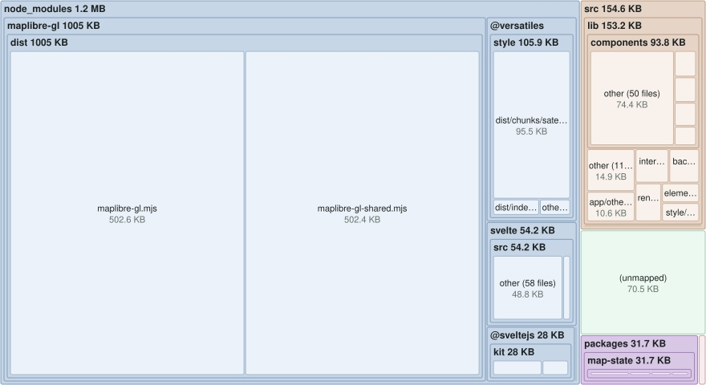
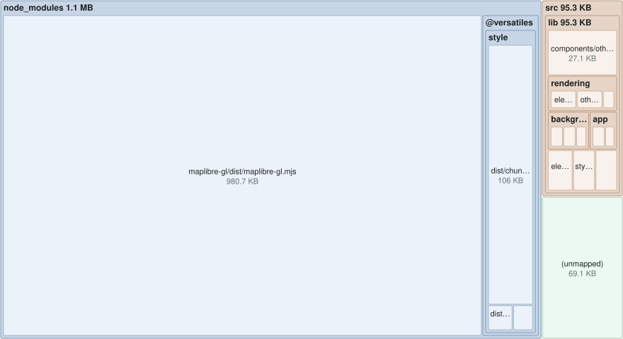

# VersaTiles Map Editor

A standalone, embeddable map editor for [VersaTiles](https://versatiles.org). Draw and style markers, lines, circles and polygons on a vector map and share the result via a self-contained URL hash.

This is a [SvelteKit](https://svelte.dev/docs/kit) application built with [MapLibre GL](https://maplibre.org/) and [`@versatiles/style`](https://github.com/versatiles-org/versatiles-style). It was extracted from [`node-versatiles-svelte`](https://github.com/versatiles-org/node-versatiles-svelte) to be developed on its own.

## Features

- **Draw** markers, lines, polygons and circles. Drag an element or its nodes to change it, select a node to delete it, and Shift-click to select several elements.
- **Style** them: symbols with color, size, rotation, halo and a label, with colors of their own for the text and the halo, and one font for all labels, which can differ from the font of the background map; lines and outlines with color, width and dash patterns; fills with color, opacity and patterns. Elements can have a popup text, and lines, polygons and circles show their length, area or radius.
- **Edit quickly**: undo and redo, duplicate (<kbd>Cmd/Ctrl</kbd>+<kbd>D</kbd>), copy and paste a style (<kbd>Cmd/Ctrl</kbd>+<kbd>Alt</kbd>+<kbd>C</kbd>/<kbd>V</kbd>), delete (<kbd>Delete</kbd>/<kbd>Backspace</kbd>).
- **Background map**: vector map or satellite imagery, with or without streets, borders and labels, with a theme, a label font in any face of the tile server (e.g. bold or condensed), a label language, fewer or no labels, and changed saturation, brightness and contrast.
- **Legend** with a position, a layout and a font. New entries start with a color of the map that the legend does not show yet.
- **Search** for addresses and places.
- **Import and export** GeoJSON and KML, and import tables (CSV/TSV) as markers, with colors and symbols by category.
- **Save** the map as a file and open it again. The editor keeps the map, its undo history and the view in the browser, so a reload keeps the work.
- **Share** a link or embed the map in a website, with a selectable precision and an optional search. Shared links and embedded maps open the read-only viewer, which phones also see in place of the editor.
- **Configurable** color schemes and fonts for an organisation, see [Configuration](#configuration).

## Development

```bash
npm install
npm run dev      # start the dev server
npm run build    # build the static site (adapter-static)
npm run preview  # preview the production build
```

### Project structure

The code is in `src/lib`, in folders by layer: each one uses the ones below it, none uses code of
one above it (only `interaction/`, `state/` and `document/` name the type of the editor's
document). From the top:

- `app/`: the two pages: `MapEditor.svelte` the editor (`/`) and `MapViewer.svelte` the read-only
  viewer (`/view/`), both around the map in `MapFrame.svelte`, with the layout and the theme

- `components/`: the Svelte components: `ui/` generic controls, `pickers/` for a color, a font or
  a symbol of the map, `shell/` the frame of the editor, `inspector/` the sidebar, `dialogs/`,
  `table_import/`, `map_viewer/` what floats over the map (also in the viewer), `map_editor/` (only
  in the editor), and `common/` the helpers of several of them

- `sessions/`: the maps of the browser storage, kept in step with the open map

- `files/`: opening, saving and downloading maps as files

- `editor/`: the map document of the editor, with its handlers, the commands on the selected
  elements, the style clipboard and the palette of used colors; only the editor loads it

- `interaction/`: selecting, moving, reshaping and drawing with the mouse and fingers

- `state/`: the history with undo and redo, and the legend that follows the styles

- `document/`: the map document of the viewer and the editor: elements, background and legend on
  the map

- `rendering/`: how the map is drawn: the layers of the elements, the editor's layers over the
  background map, and loading this style

- `element/`, `style/`: the elements with their geometry and texts, and their styles

- `background/`: the background map, its style, its symbols and fonts, and the configuration

- in `src/lib` itself: the helpers that all layers may use (`geometry`, `notify`, `event_handler`,
  `version`)

Rules:

- A module lives next to its users: in their folder, or in the nearest folder above all of them.
  One exception: `files/` is only used by the menu in `shell/` and the editor, but the file
  handling is kept together, apart from the components.
- Components import other folders with `#lib/…` (a subpath import of `package.json`), TypeScript modules with relative paths.
- A folder with an `index.ts` is imported through it, while its own modules import each other
  directly. Code that loads at different times (viewer and editor) gets no shared `index.ts`: it
  would put the editor's code into the viewer's first load.

### Quality checks

```bash
npm run check                  # lint, types, builds of app and package, unit and Playwright tests, formatting
npm run lint                   # ESLint
npm run check-types            # svelte-check (TypeScript + Svelte)
npm run format:check           # Prettier
npm run test-unit              # Vitest unit tests
npm run test-coverage          # Vitest unit tests with a coverage report
npm run test-playwright        # Playwright e2e tests: all in Chromium, those tagged @cross-browser in Firefox
npm run test-playwright-all    # Playwright e2e tests: all in Chromium and Firefox, like CI
npm run test-playwright-docker # all Playwright tests in a Linux container with a virtual display
```

Most Playwright tests check the editor itself, which works the same in every browser. So locally,
Firefox runs only the tests tagged `@cross-browser`: input, dialogs and focus, clipboard, files,
scrolling and rendering. Tag a new test like this if the browsers may differ in what it checks.

Headless Firefox on Linux cannot create a WebGL context, so MapLibre never renders there and
every Firefox test times out. That is why CI runs the Playwright tests on macOS.

### Documentation

```bash
npm run doc             # regenerate the sections below
npm run doc-bundle      # bundle treemap only
npm run doc-graph       # dependency graph only
```

### Bundle Composition

<!--- This chapter is generated automatically --->

#### Editor

[](docs/bundle-treemap-editor.svg?raw=true)

Sized by the bundle's own source map: **1261.6 KB** raw, **349.6 KB** gzipped, across 69 modules.

#### Viewer

[](docs/bundle-treemap-viewer.svg?raw=true)

Sized by the bundle's own source map: **1261.6 KB** raw, **349.6 KB** gzipped, across 69 modules.

### Dependency Graph

<!--- This chapter is generated automatically --->

[](docs/dependency-graph.svg?raw=true)

## Embedding

The read-only viewer at `/view/` (the folder `view/` next to the editor, so it needs no rewrite rules on a web server, also in a subfolder) reads the map from the URL hash, so it can be embedded in an `<iframe>`:

```html
<iframe src="https://your-host/view/#<state-hash>" style="width: 600px; height: 600px;"></iframe>
```

The state can alternatively be provided via the iframe's `data` attribute. The editor (`/`) takes the same hash, e.g. to edit a shared map further: it opens the map as a new one in the browser storage and removes the hash from the URL.

The **Share** dialog (at the top right of the editor) creates the link and the embed code, with a preview in different aspect ratios. Its options:

- **Precision**: how exactly the positions are stored, from 1 m to 36 km, each step twice the one before. _Automatic_ is fine enough for the visible area; coarser positions make shorter links.
- **Address search in the map**: visitors of the read-only map can search for a place, e.g. their street. The map content does not change. This option is stored in the map.

## Map state format

How a map is encoded (URL hash, GeoJSON, KML) is published as its own npm package,
[`@versatiles/map-state`](packages/map-state), e.g. to render shared maps in other apps or to
create links on a server. The editor uses it from `packages/map-state/src`.

The file format of the editor, `.mapjson`, is explained in
[`packages/map-state/MAPJSON.md`](packages/map-state/MAPJSON.md), with its JSON Schema in
[`packages/map-state/schema`](packages/map-state/schema).

The package is released by `npm run release`, together with the editor (see [Versions](#versions)),
when one of the commits since its version on npm changes its published files. Its tag, e.g.
`map-state-v1.1.0`, starts the workflow `release-map-state.yml`, which checks that the tag matches the
version, runs the tests of the package and publishes it to npm with provenance.

The workflow uses [npm trusted publishing](https://docs.npmjs.com/trusted-publishers), so no token
is stored in GitHub. It can only be set up for a package that exists: publish the first version
once by hand (`npm publish --workspace packages/map-state --access public`, which builds before
packing), then add the workflow as trusted publisher in the package settings on npmjs.com.

## Configuration

To run the editor on your own web server, see [Running the editor on your own web server](docs/SELF_HOSTING.md): installing a release, the web server, all fields of the configuration, and the tile server and geocoder it needs.

An organisation running the editor can use its own tile server and geocoder, start new maps where and how it likes, and offer its own color schemes and fonts, e.g. its corporate identity. Put them into `map-editor.config.jsonc` next to the editor's `index.html`. In this repository it is [`static/map-editor.config.jsonc`](static/map-editor.config.jsonc), which lists every field with its default, commented out. No rebuild is needed. The file is JSON with comments (`//` and `/* */`, and a comma after the last item is allowed). Every field is optional:

```jsonc
{
	"tileServer": "https://tiles.example.org",
	"geocoder": "https://geocode.example.org/api",
	"startView": [9.73, 53.39, 10.33, 53.74],
	"startBackground": { "builder": "osm", "options": { "theme": "gray" } },
	"defaultLanguage": "de",
	"defaultColorScheme": "corporate",
	"colorSchemes": [{ "id": "corporate", "name": "Corporate", "colors": ["#003366", "#e30613", "#f5a800"] }],
	"replaceDefaultSchemes": false,
	"fonts": ["open_sans_regular", "lato_bold"],
	"replaceDefaultFonts": false
}
```

- `tileServer` (default `https://tiles.versatiles.org`) serves the background map, the satellite imagery, the symbols (sprites) and the fonts (glyphs), with the same vector tiles (Shortbread) and `assets/` as tiles.versatiles.org. `geocoder` (default `https://geocode.versatiles.org/api`) is the address search, with the API of [Photon](https://github.com/komoot/photon). Both apply to the editor and the viewer, and only this file sets them, never a shared map.
- `startView` (`[west, south, east, north]`) is what a new map shows, instead of the country of the user (guessed from the time zone, in the EU and the US) or the whole world. `startBackground` is the background of a new map, as in `.mapjson` files, and `defaultLanguage` the language of its labels (`"user"`: of the browser, the default; `"local"`; or a code like `"de"`), unless the starting background sets one. A new map stores its background like a chosen one (unless it is the editor's default), so its links look the same on every server.
- `defaultColorScheme` is the `id` of the scheme that the color picker offers by default (one of the configured or predefined schemes); without it, the first one.
- `colorSchemes` are offered in the color picker before the predefined schemes. Each `id` may be used once; a scheme with the `id` of a predefined one replaces it. With `replaceDefaultSchemes`, only they are offered, and the first one is the default.
- The editor offers all font faces of the tile server, from its list `assets/glyphs/font_families.json`, as a family and a style (e.g. "Lato" and "Bold"), for the labels of the map and of each marker. `fonts` are glyph names of faces (e.g. `lato_bold`) that are offered first, with their families. Faces that are not available as map glyphs are skipped with a warning in the browser console. With `replaceDefaultFonts`, only they are offered. Without the list of the tile server, a few regular faces are offered.

A missing file leaves the defaults. An invalid field gets its default, so one mistake does not discard the whole file; the browser console names it, and also an unknown field, e.g. a misspelled one. The legend uses a generic font (sans-serif, serif or monospace) instead, since the map's glyph fonts are usually not available as web fonts.

## Versions

Every change on `main` is deployed to GitHub Pages once CI has passed. For running the editor on
another web server, it has releases: each is a ZIP archive of the build on the
[releases page](https://github.com/versatiles-org/versatiles-map-editor/releases), with the notes of
its changes. The version is in `package.json`, and the editor shows it as the tooltip of its title
and in the `generator` of its pages.

To release, run `npm run release` on `main`, with everything committed and the
[GitHub CLI](https://cli.github.com) logged in. `scripts/release.mjs` decides what to release, from
the [conventional commits](https://www.conventionalcommits.org) since the release before, shows it
with the changes, and asks for confirmation before it changes anything (`--dry-run` only shows it,
`--yes` releases it without asking, e.g. `npm run release -- --yes`):

1. The editor is released if a commit since the tag of its version is a feature (`feat`), a bug
   fix (`fix`), faster code (`perf`), a revert or a breaking change (`!`). Documentation, tests,
   CI, refactorings and chores alone are no reason for a release. The version is raised as
   [`vrt`](https://github.com/versatiles-org/node-release-tool) does: major for a breaking change,
   minor for a feature, else patch.
2. `@versatiles/map-state` is released by the same rules, from the commits since its version on npm
   that change its published files (its sources, schema and documents, not its tests). The editor
   contains the package, so such a commit releases the editor too.
3. It runs `npm run check`, raises the versions, writes the commits into the changelogs
   (`CHANGELOG.md`, `packages/map-state/CHANGELOG.md`), commits this, tags it (`v3.1.0`,
   `map-state-v1.1.0`), pushes the commit with only these tags, and creates the GitHub releases
   with the changes.
4. The tag `v…` starts the workflow `release-editor.yml`, which checks that the tag matches the
   version, runs the unit tests, builds the editor, and adds `versatiles-map-editor-<version>.zip`
   to its release. If no workflow started, it can be started by hand for the tag:
   `gh workflow run release-editor.yml -f tag=v3.1.0`.

The package `@versatiles/map-state` has releases of its own, with its own
[changelog](packages/map-state/CHANGELOG.md) and tags, see above. The editor continues the
versions of [`node-versatiles-svelte`](https://github.com/versatiles-org/node-versatiles-svelte), from
which it was extracted: its tags `v1.x.x` and `v2.x.x` come from there, and release no editor.

## License

MIT — see [LICENSE](LICENSE).
