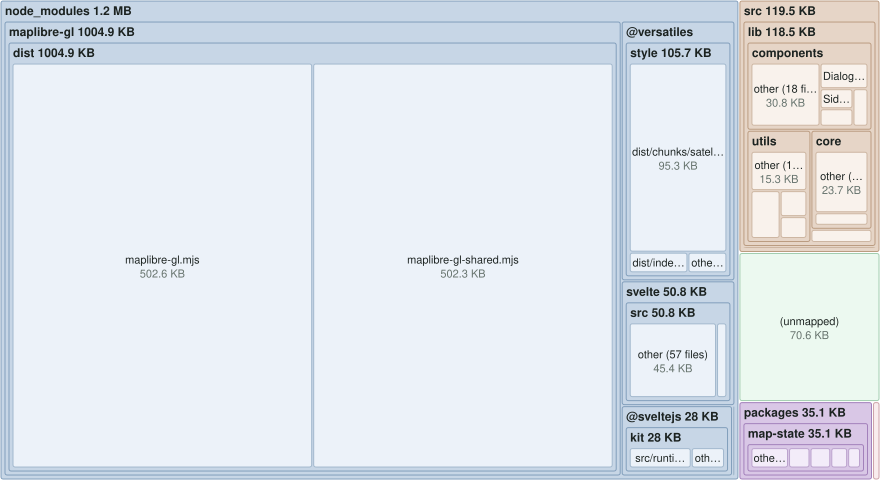

# VersaTiles Map Editor

A standalone, embeddable map editor for [VersaTiles](https://versatiles.org). Draw and style markers, lines, circles and polygons on a vector map and share the result via a self-contained URL hash.

This is a [SvelteKit](https://svelte.dev/docs/kit) application built with [MapLibre GL](https://maplibre.org/) and [`@versatiles/style`](https://github.com/versatiles-org/versatiles-style). It was extracted from [`node-versatiles-svelte`](https://github.com/versatiles-org/node-versatiles-svelte) to be developed on its own.

## Features

- **Draw** markers, lines, polygons and circles. Drag an element or its nodes to change it, select a node to delete it, and Shift-click to select several elements.
- **Style** them: symbols with color, size, rotation, halo and a label; lines and outlines with color, width and dash patterns; fills with color, opacity and patterns. Elements can have a popup text, and lines, polygons and circles show their length, area or radius.
- **Edit quickly**: undo and redo, duplicate (<kbd>Cmd/Ctrl</kbd>+<kbd>D</kbd>), copy and paste a style (<kbd>Cmd/Ctrl</kbd>+<kbd>Alt</kbd>+<kbd>C</kbd>/<kbd>V</kbd>), delete (<kbd>Delete</kbd>/<kbd>Backspace</kbd>).
- **Background map**: vector map or satellite imagery, with a theme, a label font, a label language and fewer or no labels.
- **Legend** with a position, a layout and a font. New entries start with a color of the map that the legend does not show yet.
- **Search** for addresses and places.
- **Import and export** GeoJSON and KML, and import tables (CSV/TSV) as markers, with colors and symbols by category.
- **Save** the map as a file and open it again. The address bar always holds the whole map, so a reload keeps the work.
- **Share** a link or embed the map in a website, with a selectable precision and an optional search. Embedded maps and phones show a read-only viewer.
- **Configurable** color schemes and fonts for an organisation, see [Configuration](#configuration).

## Development

```bash
npm install
npm run dev      # start the dev server
npm run build    # build the static site (adapter-static)
npm run preview  # preview the production build
```

### Quality checks

```bash
npm run check                  # lint, types, builds of app and package, unit and Playwright tests, formatting
npm run lint                   # ESLint
npm run check-types            # svelte-check (TypeScript + Svelte)
npm run format:check           # Prettier
npm run test-unit              # Vitest unit tests
npm run test-coverage          # Vitest unit tests with a coverage report
npm run test-playwright        # Playwright visual/e2e tests in Chromium and Firefox
npm run test-playwright-docker # Playwright tests in a Linux container with a virtual display
```

Headless Firefox on Linux cannot create a WebGL context, so MapLibre never renders there and
every Firefox test times out. That is why CI runs the Playwright tests on macOS.

### Documentation

```bash
npm run doc             # regenerate the sections below
npm run doc-bundle      # bundle treemap only
npm run doc-graph       # dependency graph only
```

### Bundle Composition

<!--- This chapter is generated automatically --->

[](docs/bundle-treemap.svg?raw=true)

Sized by the bundle's own source map: **1403.7 KB** raw, **396.3 KB** gzipped, across 174 modules.

### Dependency Graph

<!--- This chapter is generated automatically --->

[](docs/dependency-graph.svg?raw=true)

## Embedding

The editor reads its state from the URL hash, so it can be embedded in an `<iframe>`:

```html
<iframe src="https://your-host/#<state-hash>" style="width: 600px; height: 600px;"></iframe>
```

When embedded (i.e. not the top-level window) the editing sidebar is hidden and the map renders in read-only mode. The state can alternatively be provided via the iframe's `data` attribute.

The **Share** dialog (at the top right of the editor) creates the link and the embed code, with a preview in different aspect ratios. Its options:

- **Precision**: how exactly the positions are stored. _Automatic_ is fine enough for the current viewport; coarser positions make shorter links.
- **Address search in the map**: visitors of the read-only map can search for a place, e.g. their street. The map content does not change. This option is stored in the map.

## Map state format

How a map is encoded (URL hash, GeoJSON, KML) is published as its own npm package,
[`@versatiles/map-state`](packages/map-state), e.g. to render shared maps in other apps or to
create links on a server. The editor uses it from `packages/map-state/src`.

To release a new version of the package:

1. Raise the version in `packages/map-state/package.json` and move the entries under
   _Unreleased_ in `packages/map-state/CHANGELOG.md` to it. Commit this and push it to `main`.
2. Tag the commit with `map-state-v` and the version, and push the tag, e.g.
   `git tag map-state-v1.1.0 && git push origin map-state-v1.1.0`.
3. The workflow `release-map-state.yml` checks that the tag matches the version, runs the tests of
   the package and publishes it to npm with provenance.

The workflow uses [npm trusted publishing](https://docs.npmjs.com/trusted-publishers), so no token
is stored in GitHub. It can only be set up for a package that exists: publish the first version
once by hand (`npm publish --workspace packages/map-state --access public`, which builds before
packing), then add the workflow as trusted publisher in the package settings on npmjs.com.

## Configuration

An organisation running the editor can offer its own color schemes and fonts, e.g. its corporate identity. Put them into `map-editor.config.json` next to the editor's `index.html` (in this repository: `static/map-editor.config.json`, which is empty). No rebuild is needed. Every field is optional:

```json
{
	"colorSchemes": [{ "id": "corporate", "name": "Corporate", "colors": ["#003366", "#e30613", "#f5a800"] }],
	"replaceDefaultSchemes": false,
	"fonts": ["open_sans_regular", "lato_bold"],
	"replaceDefaultFonts": false
}
```

- `colorSchemes` are offered in the color picker before the predefined schemes. With `replaceDefaultSchemes`, only they are offered, and the first one is the default.
- `fonts` are glyph names of the tile server (see `https://tiles.versatiles.org/assets/glyphs/`). They are offered for the labels of the map and its markers. Fonts that are not available as map glyphs are skipped with a warning in the browser console. With `replaceDefaultFonts`, only they are offered.

A missing or invalid file leaves the defaults. The legend uses a generic font (sans-serif, serif or monospace) instead, since the map's glyph fonts are usually not available as web fonts.

## Versions

The editor itself has no versions: every change on `main` is deployed to GitHub Pages once CI has
passed, and the git history is its record of changes. Only the package `@versatiles/map-state` has
releases, with its own [changelog](packages/map-state/CHANGELOG.md). The tags `v2.x.x` come from the
history of [`node-versatiles-svelte`](https://github.com/versatiles-org/node-versatiles-svelte),
from which the editor was extracted.

## License

MIT — see [LICENSE](LICENSE).
